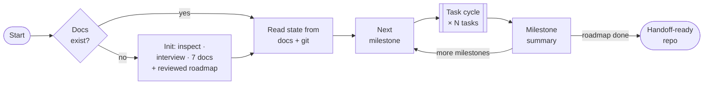
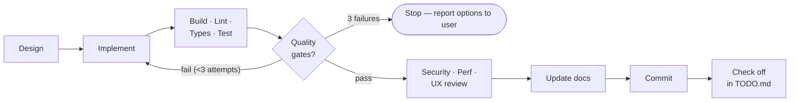
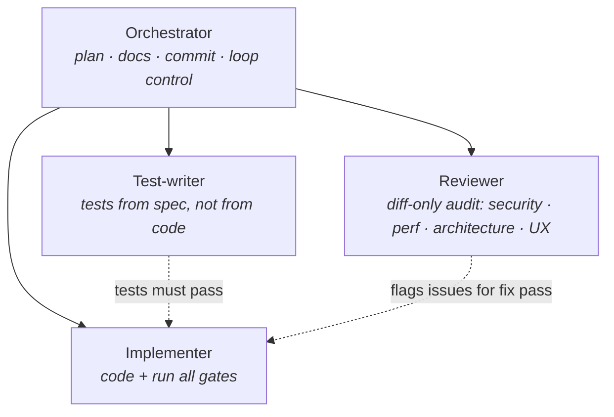

# Agentic Dev Loop

**A Claude Code skill that turns Claude into a self-directed engineering team - planning, implementing, testing, reviewing, and documenting its way through a roadmap, milestone by milestone, with built-in brakes.**

  

The loop is stateless by design: all project state lives in seven markdown docs and git history, so any session — including one that lost its context — resumes exactly where the last one stopped.

## How it works

*(Not a git repo? The loop stops and offers `git init` before anything else — per-task commits are its rollback mechanism.)*

Every task runs the same gated cycle — one task, one commit, one rewind point:

## The seven project docs

| Doc | Role |
|---|---|
| `ROADMAP.md` | Global target — 2–5 outcome-based milestones with verifiable exit criteria, executed in order |
| `TODO.md` | Working surface — milestones decomposed into single-sitting tasks just-in-time |
| `ARCHITECTURE.md` | Recorded architecture decisions — made once, never re-litigated mid-loop |
| `API.md` | Endpoint reference, updated whenever an API surface changes |
| `CHANGELOG.md` | Clean, user-facing record of what shipped |
| `EXECUTION_LOG.md` | Process journal — decisions, blockers, gate results per task |
| `KNOWN_ISSUES.md` | Open problems, accepted debt, deliberate deferrals |

## Usage

### Commands

| Command | Purpose |
|---|---|
| `/agentic-dev-loop` | Explicitly start — or resume — the loop on the current project |
| `/init-agentic-loop` | (Re)initialize the seven project docs only: presents the init summary, then stops **without** starting the loop |

### Natural-language triggers

No command needed — the loop also starts automatically on phrases like:

> *"work through the roadmap"* · *"build this autonomously"* · *"keep going until it's done"* · *"act as the dev team on this"* · *"run the agentic loop"*

It also engages when a project lacks the seven docs and you ask for ongoing autonomous work — initialization runs first: repo inspection **before** any questions, one batched interview for only the gaps, then a roadmap held to a PM-grade bar (outcome goals, verifiable exit criteria, dependency-ordered, riskiest unknown first) and adversarially reviewed (by an independent subagent when available) before you see it. An existing roadmap is audited the same way — corrections are proposed, never silently applied.

It deliberately does **not** trigger for a single small isolated fix you want done directly — just ask for that normally.

## Built-in brakes

Autonomy without a circuit breaker just means failures compound silently. The loop stops and reports when:

- the same task fails its quality gates **3×** with genuinely different approaches
- a decision has **no clearly better option** (auth provider, breaking API change, irreversible migration)
- it detects **thrashing** (undo/redo of the same change)
- a **milestone completes** — summary posted; pauses if the next milestone raises a user-intent question or you asked for check-ins
- the requested **scope is done** — it never invents work to keep looping

## Subagent role separation

On nontrivial tasks the reviewer never grades its own work:

## License

[MIT](LICENSE)
