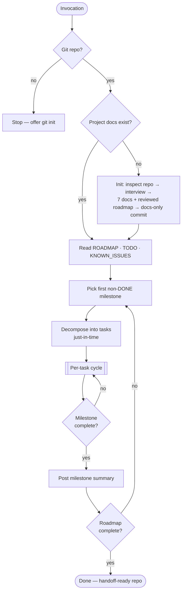
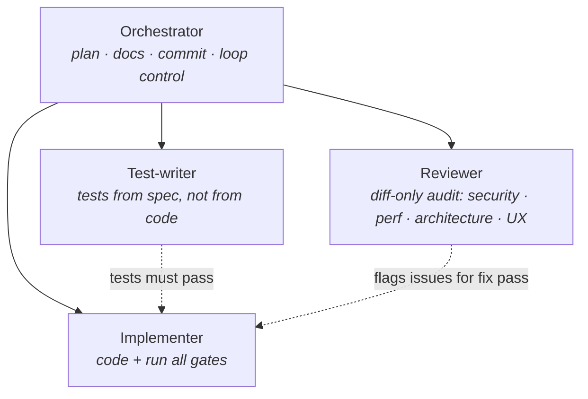

# Agentic Dev Loop

**A Claude Code skill that turns Claude into a self-directed engineering team — planning, implementing, testing, reviewing, and documenting its way through a roadmap, milestone by milestone, with built-in brakes.**

  

The loop is stateless by design: all project state lives in seven markdown docs and git history, so any session — including one that lost its context — resumes exactly where the last one stopped.

## How it works



Every task runs the same gated cycle — one task, one commit, one rewind point:


## The seven project docs

| Doc | Role |
|---|---|
| `ROADMAP.md` | Global target — 2–5 outcome-based milestones with verifiable exit criteria, executed in order |
| `TODO.md` | Working surface — milestones decomposed into single-sitting tasks just-in-time |
| `ARCHITECTURE.md` | Recorded decisions (including UI-motion: Spline 3D vs scroll animation) — never re-litigated mid-loop |
| `API.md` | Endpoint reference, updated whenever an API surface changes |
| `CHANGELOG.md` | Clean, user-facing record of what shipped |
| `EXECUTION_LOG.md` | Process journal — decisions, blockers, gate results per task |
| `KNOWN_ISSUES.md` | Open problems, accepted debt, deliberate deferrals |

## Installation

Copy **both** skill folders into your skills directory (they work as a pair):

```
.claude/skills/                 # per-project  — or —  ~/.claude/skills/  # all projects
├── agentic-dev-loop/
└── init-agentic-loop/
```

## Usage

Just ask for autonomous work — the skill triggers on phrases like:

> *"work through the roadmap"* · *"build this autonomously"* · *"keep going until it's done"* · *"act as the dev team on this"*

On a project without the docs, initialization runs first: repo inspection **before** any questions, one batched interview for only the gaps, then a roadmap held to a PM-grade bar (outcome goals, verifiable exit criteria, dependency-ordered, riskiest unknown first) and adversarially reviewed by an independent subagent before you see it. An existing roadmap is audited the same way — corrections are proposed, never silently applied.

To (re)initialize the docs **without** starting the loop:

```
/init-agentic-loop
```

## Built-in brakes

Autonomy without a circuit breaker just means failures compound silently. The loop stops and reports when:

- the same task fails its quality gates **3×** with genuinely different approaches
- a decision has **no clearly better option** (auth provider, breaking API change, irreversible migration)
- it detects **thrashing** (undo/redo of the same change)
- a **milestone completes** — summary posted; pauses if the next milestone raises a user-intent question
- the requested **scope is done** — it never invents work to keep looping

## Subagent role separation

On nontrivial tasks the reviewer never grades its own work:



## Repository layout

```
agentic-dev-loop/
├── SKILL.md                    # the loop: selection, cycle, stop conditions, subagents
├── references/                 # loaded on demand
│   ├── init-project.md         # inspection + interview + doc synthesis
│   ├── quality-gates.md        # definition of "done"
│   ├── architecture-checklist.md
│   ├── security-checklist.md
│   ├── performance-checklist.md
│   └── frontend-ux.md
└── assets/doc-templates/       # the seven project docs
init-agentic-loop/
└── SKILL.md                    # /init-agentic-loop slash command
```

## License

[MIT](LICENSE)
