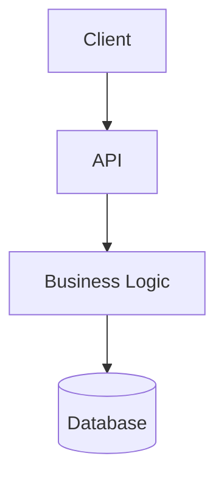

# Architecture

## Overview
One paragraph: what this system is, and the shape of its major pieces.

## Architecture decisions
| Decision | Reasoning | Alternatives considered | Date |
|---|---|---|---|
| e.g. Postgres over Mongo | relational integrity for X | Mongo, DynamoDB | YYYY-MM-DD |
| e.g. Branch strategy: dedicated `agent/<milestone>` branch, merged per milestone | remote + CI watch main | direct-to-current-branch | YYYY-MM-DD |

## Diagram


## Folder structure
```
src/
  ui/          # presentation only
  services/    # business logic
  api/         # routing, request/response shaping
  data/        # data access layer
  infra/       # config, deployment
```

## Design patterns in use
- <pattern> — where, and why it was chosen over alternatives.

## Known architectural constraints / tradeoffs
- <constraint> — accepted because <reason>.
